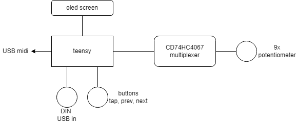

# midi-surface-control

DIY Midi control surface for Analog Lab V

## Hardware

- Teensy 3.2
- CD74HC4067 multiplexer
- 9 potentiometer
- 3 push buttons
- mini oled screen SSD1306
- USB port
- midi port

## Schematic

